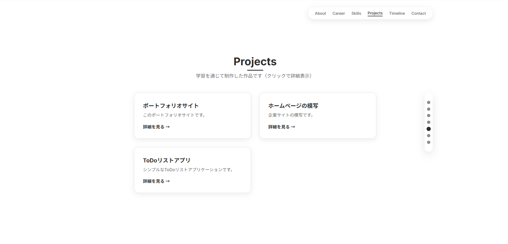
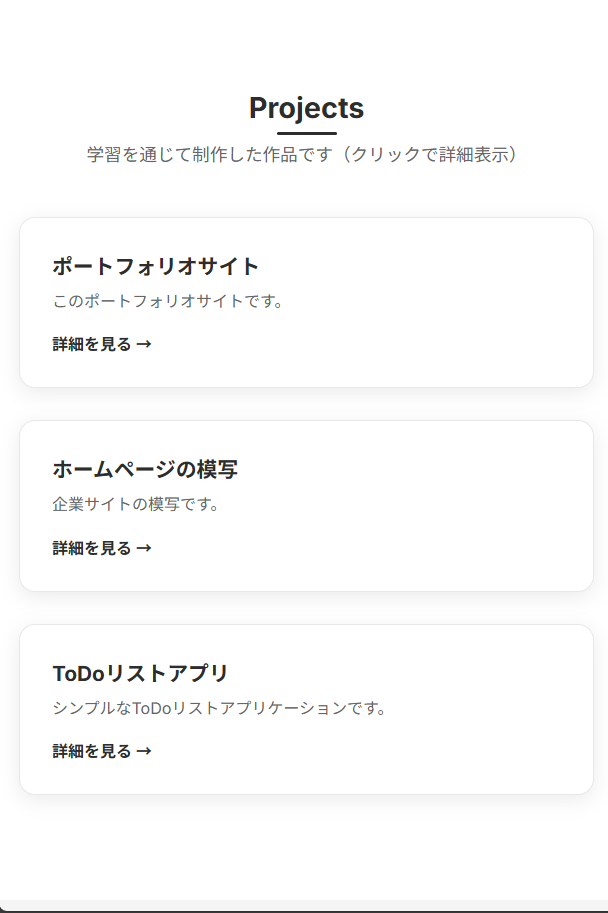
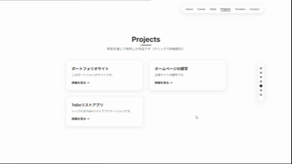
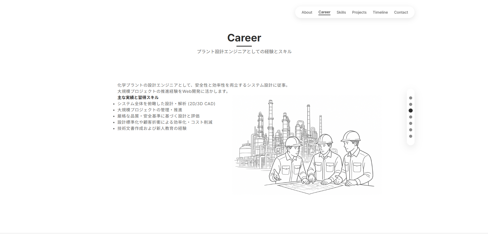

# ポートフォリオサイト

これは、IT業界への転職を目指して作成した個人のポートフォリオサイトです。


## 概要

プラント設計エンジニアからWeb開発者へのキャリアチェンジを目指し、制作したポートフォリオサイトです。基本設計とコーディングは自身で行い、複雑な実装において Google Gemini CLI と Claude を補助的に活用することで、効率的かつ実践的な開発スキルの習得に取り組みました。


## 主な特徴

<table>
  <tr>
    <td width="50%">
  <h3>レスポンシブデザイン</h3>
  <p>PC、タブレット、スマートフォンなど、あらゆるデバイスで最適に表示されます。</p>
  
  
</td>
    <td width="50%">
  <h3>インタラクティブなUI</h3>
  <p>スクロールアニメーションや、プロジェクト詳細を閲覧できるモーダルウィンドウを実装しました。</p>
  
</td>
  </tr>
  <tr>
    <td width="50%">
      <h3>視覚的なタイムライン</h3>
      <p>自身の誕生から現在までの歩みを、写真付きのタイムラインで分かりやすく表現しました。</p>
      
    </td>
    <td width="50%">
      <h3>モダンなデザイン</h3>
      <p>白と黒を基調としたミニマルなデザインで、情報を整理し、見やすさを重視しました。</p>
      
    </td>
  </tr>
</table>


## 使用技術

| 技術 | 説明 |
|------|------|
| **HTML5** | セマンティックなマークアップを実装 |
| **CSS3** | Flexbox, Grid Layout, Keyframe Animationsなどを活用 |
| **JavaScript (ES6+)** | Intersection Observer APIを使用したスクロールイベントの制御、モーダルウィンドウ、ナビゲーションの制御などを実装 |
| **Git / GitHub** | バージョン管理を行っています |


## セットアップ
1. **Gitをインストールする**  
   お使いのPCに[Git](https://git-scm.com/)をインストールします。

2. **リポジトリをクローンする**  
   ターミナルやコマンドプロンプトを開いて、以下のコマンドを実行してください。

   ```
   git clone https://github.com/Yuri-Inaishi/My-portfolio.git
   ```

3. **クローンしたディレクトリに移動する**  
   ```
   cd My-portfolio
   ```

4. **ポートフォリオサイトを開く**  
   `index.html` ファイルをダブルクリックするか、任意のウェブブラウザで開いてください。

> ※追加のインストールやビルド作業などは不要です。すぐにポートフォリオサイトを確認できます。


## 製作者

- **名前**: 稲石 湧李 (Yuri Inaishi)
- **Email**: yuri.0228ex @gmail.com
- **GitHub**: [Yuri-Inaishi](https://github.com/Yuri-Inaishi)
